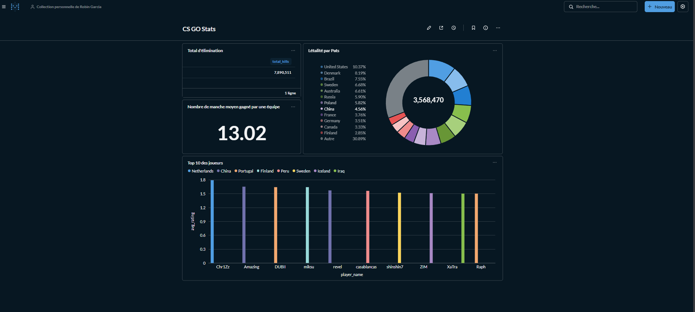
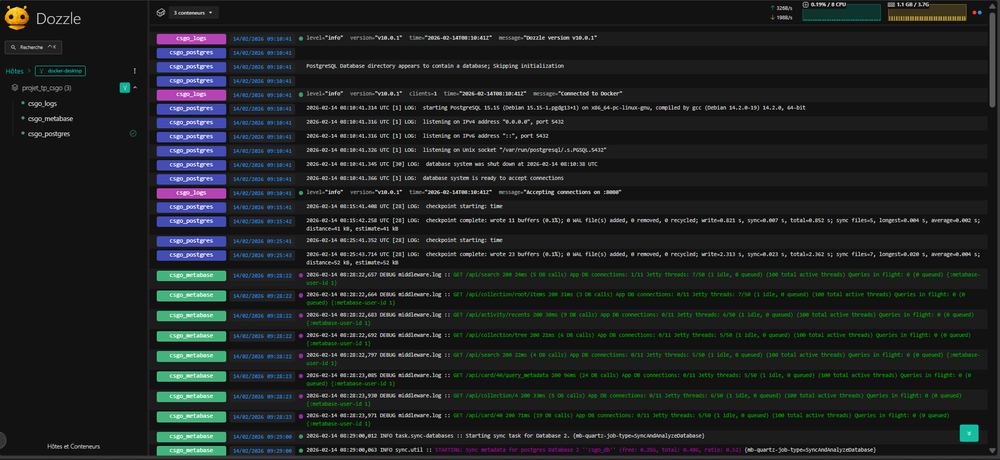

# Analyse de Statistiques CS:GO (Projet ETL)

## Equipe
* **Garcia Robin**
* **Boutet Thomas**

---

## Jeu de Données (Etape 1)
* **Source :** https://www.kaggle.com/datasets/mateusdmachado/csgo-professional-matches
* **Contenu :** Environ 50 000 matchs compétitifs.
* **Caracteristiques :** 4 fichiers CSV (results.csv, players.csv, picks.csv, economy.csv) contenant des statistiques in-game détaillées.

---

## Architecture Technique (Etape 2)

| Composant | Technologie | Rôle |
| :--- | :--- | :--- |
| **Extract/Load** | PostgreSQL 15 | Stockage des données brutes (RAW) et transformées. |
| **Transformation** | Python (Pandas & SQLAlchemy) | Nettoyage, typage et normalisation des donnees. |
| **Visualisation** | Metabase | Creation de dashboards analytiques. |
| **Orchestration** | Docker Compose | Conteneurisation de toute l'infrastructure. |

---

## Installation et Lancement

### 1. Prérequis
* Docker Desktop et Python 3.10+
* Extraire les fichiers CSV dans le dossier `./data/`

### 2. Démarrage
```bash
# Lancer l'infrastructure (Base de donnees + Metabase)
docker-compose up -d
```

### 3. Execution de l'ETL
Ouvrir et executer le notebook : ETL.ipynb. 
Ce script automatise l'extraction/importation (Extract-Load) et la restructuration des donnees (Transform).


## Modèle relationnel (Etape 3)
### Schéma écrit
country\
id_country(pk)
name(uk)
player\
id_player(pk)
id_country(fk)
player_team_match\
    id_player(pk;fk);
    id_team_match(pk;fk);
    stats_joueur_dans_match;

team\
team_match\
    id_team(pk;fk);
    id_match(pk;fk);
    winner: bool;
    stat_team_dans_match;

match\
id_match(pk)
id_map(fk)
map\
id_map(pk)

### Cardinalités

Un joueur peut participer à plusieurs matchs (1,N)\
Une équipe peut jouer plusieurs matchs (1,N)\
Un match se joue sur une carte (1,1)\
Un match implique deux équipes via team_match (2,2)\
Chaque participation de joueur est liée à une équipe et un match via team_match

### Schéma Mermaid
Si le schéma suivant ne fonctionne pas une capture d'écran est présente avec ce Readme.

[](https://mermaid.live/edit#pako:eNqVVMGO2jAQ_RXL5yyCZANJbojuqhKlRSv2sBVSNI0d4pLYke20pcC_b5zAQoipVJ_iN2_em5nY3uNEEIojTOUnBhsJxZqjei2_TN-eXtDh8PAg9mj27fXr6uUNRQjKEqRmlGsbr93Fq6fpIl5MV7PPdUbDT1hJ2wQTO9M7vJ-iOlFaxMZJBL_yXkyXLeuAzoQ1VrRRQqqSa3yxjDuitjrrVA1aIULPeeeu9-3WLMY1YiRORMW13KHl_BL6BTLJQCIOxamPY2dEfZUyhx2VVpE2FF-0LObP8w-bq9H2bTSFwmpiAo0Fer2VMqPtKxVQWoVq_K6OGa5NSSdZR4uApqiBY_Np9bZ2HN_zOPXtPM_v2ndiP4TIKXDEVPybcU5lN00lQtIb__45-sdfthXyvzWa2JbluepChILObjBQiil9BfKqoJIlSIJmfNPHgcg-uAWlb-wJYWnaxTIKRGVC35SQbvvUNAeVxZ3ijtjBG8kIjrSsqINr5wLMFjfTXGOd0foeYHNHCcituZ8mpwT-XYjinCZFtclwlEKu6l1VmmN0etM-KJQTKmfmAuHIc_1GA0d7_AdH7nA8mIShPwrC0B36nh84eIej8cCbDB-HjxPXCzxvHPhHB_9tXIeDMBiPatANR8EkmLgjB1PCtJCL9kltXtbjO09jlAU)

## Modèle Dimensionnel
DimCoutry
nom

DimPlayer
nom
age

DimMap
nom

DimTeam
nom

DimMatch

DimDate
jourssemaine
joursmois
mois
annee
trimester
semestre

Fait_participationJoueur
fk_dim_player
fk_dim_match
fk_dim_team
fk_dim_map
fk_dim_date
stats

Fait_ParticipationTeam
fk_dim_match
fk_dim_team
fk_dim_map
fk_dim_date
stats

### Schéma Mermaid
Si le schéma suivant ne fonctionne pas une capture d'écran est présente avec ce Readme.

[](https://mermaid.live/edit#pako:eNq9VsuO2jAU_RXLawZlCIQhuwgYlbYMCIXFVEiRmxjiktiR7bSlDP_Sf-mP1TGQIa8qbJpFJN_jc-x777HlI_RZgKENMZ8QtOMo3lCgvsls7i0_O6_TFXh7e3hgR_DszFxv6azc2Xi2dNzZ4sX7uFhP1ytggw1MEJfEJwnewHeB8WL94q5e2yocxC3ZnTrzdsxvLMUgQLRAnzvu-EM7fpW6bEcUKb_lTRx32o745zeIkNqyzMvVOm8NX7O-J-GceF-6Oe2-ZHNaMdWqN47nUPYRKgEJvIDEns9SKvkBLD-9w98R90PEwQXzKIrxGT3dCl9cW6-bROiAea3sGWpSzYpULxmjpFZPxZvEdHHq1SRGca1cBjRvLmt90_akHxYUs14AHfZ0W6p6urf1cppcUct-qmdxEmE1WtdsX7mVewLHiFBcFNZIzIgohqsRRCkucSUnMRaSl8JqnZtonlrzmazmukVEetdLDUnCqJcduLTonWzydn_rrOd69OrnBvjcpAZQW6KRmDRBujFlbE-iqFTWACMZlkstBBHyJkjTGHPiA65KQXfVOAp4NbhHQpaWDwKy3RZjIUaBCJkU5SyqU7cREqFX2Ny_mttwzGpaWzl1_7s3XxmLMKKACO8HUT7nJUP7LHcz7MAdJwG0JU9xB6pSq0OlhlBnuoEyVO7fwPNNz_fZrZtxEkS_MBZfaZyluxDaWxQJNUqTbEeXB0A-BdMA83HmXGj3DS0B7SP8CW3TsLpPveHAGhmG2e8Zgw48qDmj7qNp9c2RZfWGo6fH4eDUgb_0okbXskyr1xsNB2Z_1O9ZZgfigEjG5-fnh36FnP4C9iyOjg)


### Explication

Tables de dimensions :

dim_player (nom, pays)
dim_map (nom)
dim_team (nom)
dim_match (date)
dim_date (jour_semaine, jour_mois, mois, annee, trimestre, semestre)

Tables de faits :

fait_participation_joueur (toutes les FK + stats du joueur : kills, deaths, assists, rating, adr, kast, kddiff, headshots, fkdiff, flash_assists)
fait_participation_team (toutes les FK + stats de l'équipe : is_winner, score)


# Visualisation (KPIs)
Le tableau de bord CS:GO est configuré sur Metabase (port 8080) avec les indicateurs suivants :
Indicateurs d'agrégation simple :

    Volume de Frag : Nombre total de kills enregistrés sur la période sélectionnée.
    Score Moyen : Score moyen des équipes par match pour évaluer l'équilibre des parties.

Indicateurs de mesures croisées :

    Top 10 des Joueurs (Bar Chart) : Classement des joueurs par rating moyen, croisé avec leur pays d'origine.
    Létalité par Pays (Heatmap) : Distribution du nombre de headshots cumulés par dim_country.




# Centralisation des Logs (Dozzle)

Pour surveiller la stabilité de l'infrastructure, nous avons intégré Dozzle.

Accès : http://localhost:8888
Fonctionnalité : Visualisation en temps réel des flux stdout/stderr des conteneurs csgo_postgres, csgo_metabase.



# Accès Metabase

http://localhost:8080

### Identifiants Metabase :
User : epsi@gmail.com
Password : azerty1234!

# Dozzle (Logs & Performance)
http://localhost:8888

# PostgreSQL
localhost:5432

